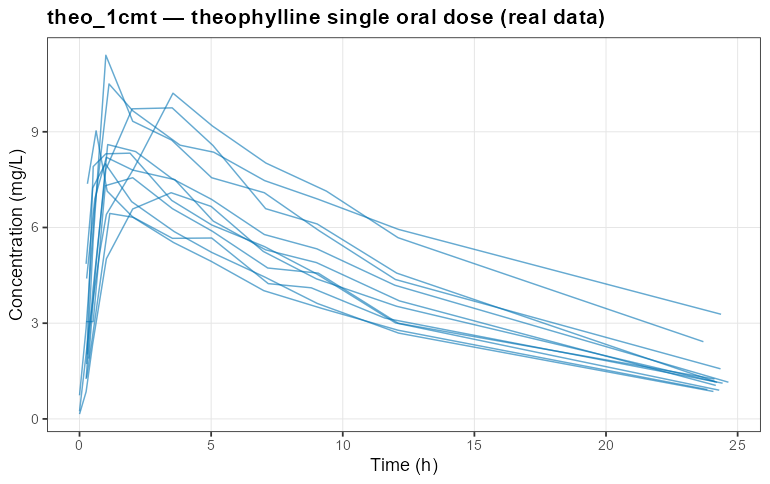
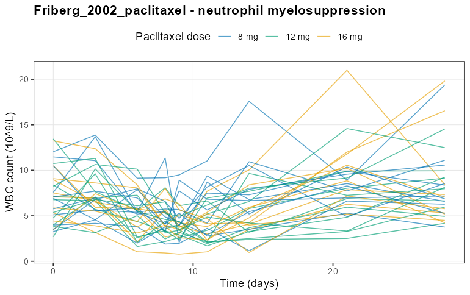

# nlmixr2qual — models and estimation methods

This document describes what the qualification suite currently covers: the seven
models it re-fits (the canonical theophylline example on real data in two solver
variants, three `nlmixr2lib` PK templates, one disease-progression model, and the
Friberg myelosuppression PKPD model), the estimation methods it exercises, the
as-fit model code, and a spaghetti plot of each frozen dataset.

> **Reproducibility, not correctness.** These models and datasets are a frozen
> *regression reference*. A qualification PASS means an installation reproduces
> the shipped canonical baseline within tolerance — it does not assert the models
> are physiologically correct or the parameter values are "true". The simulated
> datasets are deliberately never regenerated (see
> [`data-raw/simulate-datasets.R`](../data-raw/simulate-datasets.R)).

## Coverage at a glance

| Model | Domain | Structure | Primary method | IIV (`eta`) |
|---|---|---|---|---|
| `theo_1cmt` | popPK | 1-compartment oral, solved (`linCmt`) — **real** theophylline data (**anchor**) | focei | own (Ka, CL, V) |
| `theo_1cmt_des` | popPK | 1-compartment oral, explicit ODEs — **real** theophylline data | focei | own (Ka, CL, V) |
| `PK_2cmt` | popPK | 2-compartment oral, solved (**anchor**) | focei | added on CL, V |
| `PK_3cmt` | popPK | 3-compartment oral, solved | focei | added on CL, V |
| `PK_2cmt_no_depot` | popPK | 2-compartment IV, explicit ODEs | focei | added on CL, V |
| `Lee_2011_parkinson_progression` | disease | UPDRS disease-progression + symptomatic effect | focei | own (slope, symptomatic) |
| `Friberg_2002_paclitaxel` | PKPD | Semi-mechanistic neutrophil myelosuppression | focei | own (baseline, MTT, slope) |

The three bare `PK_*` templates ship with fixed effects only; the suite augments
each with between-subject variability (IIV) on clearance (`lcl`) and central
volume (`lvc`) via `nlmixr2lib::addEta()`, so there is a real random-effect signal
to estimate. The two theophylline models (`theo_1cmt`, `theo_1cmt_des` — the
canonical nlmixr2 example in its solved and ODE forms, both fit to the **real**
theophylline dataset), the Lee disease-progression model, and the Friberg
myelosuppression model already carry their own IIV and are used verbatim.
Augmentation is applied identically in simulation, fitting, and baseline capture
through the shared `qual_prepare_model()` helper.

---

## popPK models

### theo_1cmt — one-compartment oral (real theophylline data)

The canonical nlmixr2 one-compartment oral example, and the suite's base/sanity
case — the only model fit to **real** data rather than a simulated reference. It
uses the classic theophylline single-dose dataset shipped with the stack
(`nlmixr2data::theo_sd`: 12 subjects, one oral dose each), frozen verbatim to
`inst/extdata/theo_sd.csv`. First-order absorption into one disposition
compartment solved with `linCmt()`, with IIV on `Ka`, `CL`, and `V` and an
additive residual. Used verbatim (`source = "file"`,
[`inst/models/theo_1cmt.R`](../inst/models/theo_1cmt.R)); its `eta` in the
registry is blank.

```r
ini({
  tka <- 0.45                   # log Ka
  tcl <- log(c(0, 2.7, 100))    # log CL, with lower/upper bounds
  tv  <- 3.45                   # log V
  eta.ka ~ 0.6
  eta.cl ~ 0.3
  eta.v  ~ 0.1
  add.sd <- 0.7                 # additive residual SD
})
model({
  ka <- exp(tka + eta.ka)
  cl <- exp(tcl + eta.cl)
  v  <- exp(tv  + eta.v)
  linCmt() ~ add(add.sd)
})
```



`theo_1cmt` is the suite's primary one-compartment **anchor** (re-fit in the
thread-invariance stage and used as the method-coverage anchor).

### theo_1cmt_des — one-compartment oral, explicit ODEs (real theophylline data)

The same theophylline model and the same real `theo_sd` data as `theo_1cmt`, but
written as explicit differential equations rather than the closed-form `linCmt()`
solver — so the qualification exercises the ODE-solver code path on real data.
Used verbatim ([`inst/models/theo_1cmt_des.R`](../inst/models/theo_1cmt_des.R)).
It reaches essentially the same optimum as the solved form (OFV ≈ 116.80).

```r
ini({
  tka <- 0.45   # log Ka
  tcl <- 1      # log CL
  tv  <- 3.45   # log V
  eta.ka ~ 0.6
  eta.cl ~ 0.3
  eta.v  ~ 0.1
  add.sd <- 0.7
})
model({
  ka <- exp(tka + eta.ka)
  cl <- exp(tcl + eta.cl)
  v  <- exp(tv  + eta.v)
  d/dt(depot)  <- -ka * depot
  d/dt(center) <-  ka * depot - cl / v * center
  cp <- center / v
  cp ~ add(add.sd)
})
```

The dataset is identical to `theo_1cmt` (see the spaghetti plot above).

### PK_2cmt — two-compartment oral

Adds a peripheral compartment (peripheral volume `Vp`, inter-compartmental
clearance `Q`) to the one-compartment oral model, again via `linCmt()`. The extra
compartment produces the characteristic bi-phasic decline.

```r
ini({
  lka    <- 0.45          # Absorption rate (Ka)
  lcl    <- 1             # Clearance (CL)
  lvc    <- 3             # Central volume (V)
  lvp    <- 5             # Peripheral volume (Vp)
  lq     <- 0.1           # Inter-compartmental clearance (Q)
  propSd <- c(0, 0.5)
  etaLcl ~ 0.1
  etaLvc ~ 0.1
})
model({
  ka <- exp(lka); cl <- exp(lcl + etaLcl); vc <- exp(lvc + etaLvc)
  vp <- exp(lvp); q <- exp(lq)
  Cc <- linCmt()
  Cc ~ prop(propSd)
})
```


### PK_3cmt — three-compartment oral

Two peripheral compartments (`Vp`, `Vp2`, `Q`, `Q2`) — the most parameter-rich of
the solved PK models, and the slowest to fit.

```r
ini({
  lka    <- 0.45          # Absorption rate (Ka)
  lcl    <- 1             # Clearance (CL)
  lvc    <- 3             # Central volume (V)
  lvp    <- 5             # First peripheral volume (Vp)
  lvp2   <- 8             # Second peripheral volume (Vp2)
  lq     <- 0.1           # First inter-compartmental clearance (Q)
  lq2    <- 0.5           # Second inter-compartmental clearance (Q2)
  propSd <- c(0, 0.5)
  etaLcl ~ 0.1
  etaLvc ~ 0.1
})
model({
  ka <- exp(lka); cl <- exp(lcl + etaLcl); vc <- exp(lvc + etaLvc)
  vp <- exp(lvp); vp2 <- exp(lvp2); q <- exp(lq); q2 <- exp(lq2)
  Cc <- linCmt()
  Cc ~ prop(propSd)
})
```


### PK_2cmt_no_depot — two-compartment IV, explicit ODEs

Two-compartment disposition with **intravenous** dosing (no absorption/depot),
written as explicit ODEs. Dosing is directly into the central compartment, so the
profiles start at their peak and decline bi-phasically.

```r
ini({
  lcl    <- 1             # Clearance (CL)
  lvc    <- 3             # Central volume (V)
  lvp    <- 5             # Peripheral volume (Vp)
  lq     <- 0.1           # Inter-compartmental clearance (Q)
  propSd <- c(0, 0.5)
  etaLcl ~ 0.1
  etaLvc ~ 0.1
})
model({
  cl <- exp(lcl + etaLcl); vc <- exp(lvc + etaLvc)
  vp <- exp(lvp); q <- exp(lq)
  kel <- cl/vc; k12 <- q/vc; k21 <- q/vp
  d/dt(central)     <- -kel * central - k12 * central + k21 * peripheral1
  d/dt(peripheral1) <-  k12 * central - k21 * peripheral1
  Cc <- central / vc
  Cc ~ prop(propSd)
})
```


---

## Disease-progression models

### Lee_2011_parkinson_progression

A Parkinson's-disease progression model for the change in the Unified Parkinson's
Disease Rating Scale (UPDRS) from baseline. It is algebraic in `time`: a linear
natural-progression slope minus a symptomatic drug effect that approaches an
asymptote first-order. The binary covariate `ON_TREATMENT` (1 = active drug,
0 = placebo) modifies both the progression slope and the symptomatic effect, so
the two arms diverge over time. IIV is carried on the slope and the symptomatic
effect. Used verbatim (no augmentation).

```r
ini({
  beta0     <- 0.73          # Placebo progression slope (UPDRS/month)
  beta1     <- -0.3          # Active-drug effect on slope
  gamma0    <- 1.12          # Placebo asymptotic symptomatic dip (UPDRS)
  gamma1    <- 1.61          # Active-drug additional symptomatic dip
  lke0      <- log(1.46)     # Log rate to symptomatic asymptote (1/month)
  etaslope  ~ 0.47
  etasymeff ~ 18.61
  addSd     <- sqrt(8.53)    # Additive residual SD (UPDRS)
})
model({
  slope  <- beta0 + beta1 * ON_TREATMENT + etaslope
  symeff <- gamma0 + gamma1 * ON_TREATMENT + etasymeff
  ke0    <- exp(lke0)
  deltaUPDRS <- slope * time - symeff * (1 - exp(-ke0 * time))
  deltaUPDRS ~ add(addSd)
})
```


---

## PKPD models

### Friberg_2002_paclitaxel

The classic Friberg semi-mechanistic model of chemotherapy-induced
myelosuppression. Paclitaxel two-compartment PK drives a proliferating-precursor
compartment that feeds a chain of three transit compartments into the circulating
neutrophil pool (`circ`); the drug lowers proliferation (`edrug = 1 - slopu·Cc`)
and a `(circ0/circ)^gamma` feedback loop drives recovery and the characteristic
rebound overshoot. The endpoint is the circulating WBC count with a
**proportional** residual, so simulated values are non-negative by construction —
the reason this model was chosen to replace an earlier additive-error progression
model whose simulated data could dip below zero. IIV is carried on the baseline
count, mean transit time, and drug-effect slope; the model is used verbatim and
reads the individual paclitaxel PK as covariate columns (`VC_INDIV`, `CL_INDIV`,
`VP_INDIV`).

```r
ini({
  lcirc0 <- 1.975   # log baseline circulating count (circ0)
  lmtt   <- 4.820   # log mean transit time (MTT)
  lslopu <- 3.364   # log drug-effect slope
  gamma  <- 0.239   # feedback exponent
  propSd <- 0.286   # proportional residual error
  etalcirc0 ~ 0.107
  etalmtt   ~ 0.0296
  etalslopu ~ 0.176
})
model({
  circ0 <- exp(lcirc0 + etalcirc0)
  mtt   <- exp(lmtt + etalmtt)
  slopu <- exp(lslopu + etalslopu)
  q  <- 204
  Cc <- central / VC_INDIV
  edrug <- 1 - slopu * Cc
  feed  <- (circ0 / circ)^gamma
  ktr   <- 4 / mtt
  d/dt(central)     <- -q/VC_INDIV*central - CL_INDIV/VC_INDIV*central + q/VP_INDIV*peripheral1
  d/dt(peripheral1) <-  q/VC_INDIV*central - q/VP_INDIV*peripheral1
  d/dt(circ)        <- ktr*precursor4 - ktr*circ
  d/dt(precursor1)  <- ktr*precursor1*edrug*feed - ktr*precursor1
  d/dt(precursor2)  <- ktr*precursor1 - ktr*precursor2
  d/dt(precursor3)  <- ktr*precursor2 - ktr*precursor3
  d/dt(precursor4)  <- ktr*precursor3 - ktr*precursor4
  circ(0) <- circ0; precursor1(0) <- circ0; precursor2(0) <- circ0
  precursor3(0) <- circ0; precursor4(0) <- circ0
  WBC <- circ
  WBC ~ prop(propSd)
})
```



---

## Datasets and simulation design

Each model has one permanently frozen dataset under
[`inst/extdata/`](../inst/extdata). The two theophylline models (`theo_1cmt` and
`theo_1cmt_des`) share **real** data — the classic `nlmixr2data::theo_sd`
theophylline set (12 subjects, one oral dose, samples to ~24 h) written out
verbatim. The simulated `PK_*` datasets are 32 subjects dosed
across four levels (50/100/150/200 mg) with samples at 0.25–24 h. `Lee` is 40
subjects over 0–24 months, half randomised to active treatment. `Friberg` is 32
subjects given a single moderate paclitaxel dose with WBC sampled around the
~day-9 nadir and recovery to day 28; each subject carries individual paclitaxel
PK (`VC/CL/VP_INDIV`) as covariate columns, and a `stopifnot(all(DV > 0))` guard
enforces that the frozen WBC values stay positive. The simulated sets were
generated once, single-threaded, from the same model used for fitting, at a fixed
seed. Spaghetti plots above use the Okabe–Ito colourblind-safe palette, colouring
`PK_*` and `Friberg` profiles by dose and the Lee profiles by treatment arm.

---

## Estimation methods

`nlmixr2` exposes 26 estimation methods across six algorithm families. The full
matrix is catalogued in [`inst/models/methods.csv`](../inst/models/methods.csv)
and validated against the installed estimator set. This release **cuts anchor
baselines for the two methods below** — `focei` (the primary conditional method)
and `saem` (the oldest, most robust stochastic method); the remaining methods are
catalogued but their baselines are a tracked follow-up (see
[`follow-up-deferred-scope.md`](follow-up-deferred-scope.md)).

### focei — first-order conditional estimation with interaction *(primary)*

The workhorse method. FOCE linearises the model around each subject's conditional
(empirical Bayes) random effects; the **i** adds the interaction between the
random effects and the residual error variance. Every model in the registry is
qualified with `focei`: the strict stage re-fits each model single-threaded and
compares the objective function value, parameters, standard errors, and shrinkage
against the shipped baseline.

`nlmixr2qual` pins the **outer optimizer to `bobyqa`** for the conditional FOCE
methods (via `qual_fit_control()`). The default (`nlminb`) reaches the same
optimum but emits a tolerance-sensitive "false convergence (8)" advisory there,
which would make the fingerprint's convergence flag brittle across platforms;
`bobyqa` exits cleanly with convergence code 0.

### saem — stochastic approximation expectation-maximisation *(anchor)*

The oldest and most robust nonlinear mixed-effects estimation method, and a more
meaningful second anchor than a FOCE variant. A baseline is cut for `saem` on the
`theo_1cmt` anchor to show the qualification machinery covers more than one
algorithm family. Because SAEM is **stochastic**, `qual_fit_control()` pins its
random seed (99) and iteration budget (nBurn 200, nEm 300) so the run is
reproducible, and it is compared under the looser **stochastic tolerance**
(`qual_tolerance(stochastic = TRUE)`). It is qualified as **informational**
(`strict = FALSE` in `methods.csv`): a seeded re-fit on the same machine
reproduces the baseline exactly, but seeded stochastic estimation is not
guaranteed to reproduce across platforms, so a SAEM deviation is reported without
failing the verdict. The method-coverage test (`test-qual-methods.R`) qualifies
any method that has an anchor baseline.

### Full method catalogue

`needs_reff = FALSE` optimizer methods fit fixed effects only and are anchored to
`theo_1cmt_fixed` (a random-effect-free variant); all others anchor to
`theo_1cmt`.

| Family | Methods | Baseline status |
|---|---|---|
| Linearized | `fo`, `foi`, `foce`, `focei`, `focep`, `nlme` | `focei` cut (primary); rest deferred |
| Integral approximation | `laplace`, `agq`, `imp`, `impmap` | deferred |
| Stochastic EM | `saem`, `fsaem`, `qrpem` | `saem` cut (informational anchor); rest deferred |
| Nonparametric | `npag`, `npb` | deferred (needs non-parametric extraction) |
| Machine learning | `advi`, `vae` | deferred (needs ELBO/variational extraction) |
| Optimizer (NLM family) | `nlm`, `nlminb`, `bobyqa`, `newuoa`, `uobyqa`, `n1qn1`, `lbfgsb3c`, `optim`, `nls` | deferred (fixed-effect anchor) |

The nonparametric and machine-learning families do not expose the standard
parametric accessors (`parFixedDf`/`omega`/`sigma`), so `qual_extract_fit()` needs
category-specific extraction before they can be fingerprinted — this is the main
piece of work behind completing the matrix.
