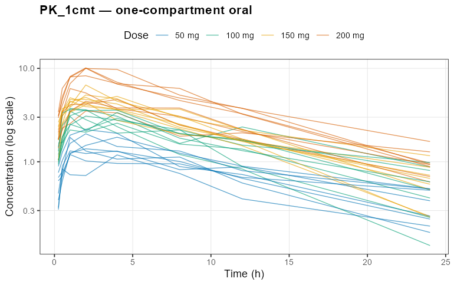
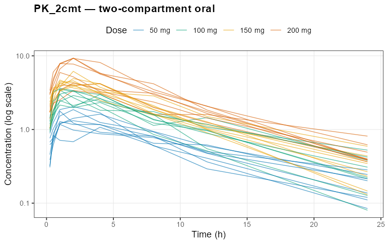
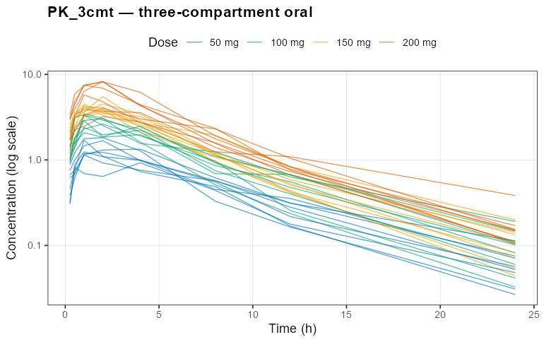
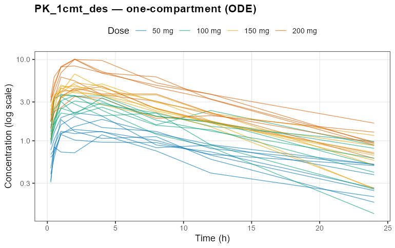
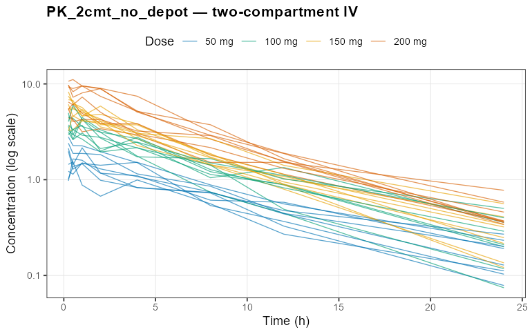
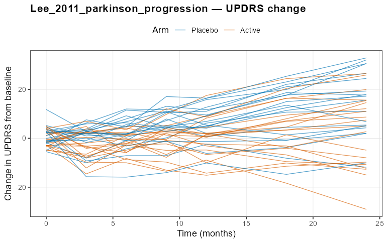
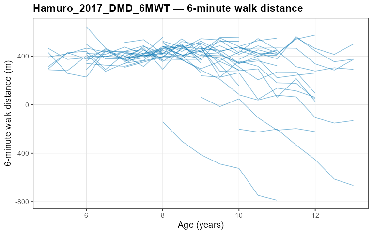

# nlmixr2qual — models and estimation methods

This document describes what the qualification suite currently covers: the seven
`nlmixr2lib` models it re-fits, the estimation methods it exercises, the as-fit
model code, and a spaghetti plot of each frozen dataset.

> **Reproducibility, not correctness.** These models and datasets are a frozen
> *regression reference*. A qualification PASS means an installation reproduces
> the shipped canonical baseline within tolerance — it does not assert the models
> are physiologically correct or the parameter values are "true". The simulated
> datasets are deliberately never regenerated (see
> [`data-raw/simulate-datasets.R`](../data-raw/simulate-datasets.R)).

## Coverage at a glance

| Model | Domain | Structure | Primary method | IIV (`eta`) |
|---|---|---|---|---|
| `PK_1cmt` | popPK | 1-compartment oral, solved (`linCmt`) | focei | added on CL, V |
| `PK_2cmt` | popPK | 2-compartment oral, solved | focei | added on CL, V |
| `PK_3cmt` | popPK | 3-compartment oral, solved | focei | added on CL, V |
| `PK_1cmt_des` | popPK | 1-compartment oral, explicit ODEs | focei | added on CL, V |
| `PK_2cmt_no_depot` | popPK | 2-compartment IV, explicit ODEs | focei | added on CL, V |
| `Lee_2011_parkinson_progression` | disease | UPDRS disease-progression + symptomatic effect | focei | own (slope, symptomatic) |
| `Hamuro_2017_DMD_6MWT` | disease | Bilinear 6-minute-walk vs age | focei | own (both slopes) |

The five bare PK templates ship with fixed effects only; the suite augments each
with between-subject variability (IIV) on clearance (`lcl`) and central volume
(`lvc`) via `nlmixr2lib::addEta()`, so there is a real random-effect signal to
estimate. The two disease models already carry their own IIV and are used
verbatim. Augmentation is applied identically in simulation, fitting, and
baseline capture through the shared `qual_prepare_model()` helper.

---

## popPK models

### PK_1cmt — one-compartment oral

First-order absorption from a depot into a single disposition compartment with
linear (first-order) elimination, evaluated with the closed-form solver
`linCmt()`. Parameters: absorption rate `ka`, clearance `CL`, central volume `V`,
proportional residual error. Oral dosing (depot → central); observation is plasma
concentration `Cc`.

```r
ini({
  lka    <- 0.45          # Absorption rate (Ka)
  lcl    <- 1             # Clearance (CL)
  lvc    <- 3.45          # Central volume of distribution (V)
  propSd <- c(0, 0.5)     # Proportional residual error
  etaLcl ~ 0.1            # IIV on CL   (added by qualification)
  etaLvc ~ 0.1            # IIV on V    (added by qualification)
})
model({
  ka <- exp(lka)
  cl <- exp(lcl + etaLcl)
  vc <- exp(lvc + etaLvc)
  Cc <- linCmt()
  Cc ~ prop(propSd)
})
```



### PK_2cmt — two-compartment oral

Adds a peripheral compartment (peripheral volume `Vp`, inter-compartmental
clearance `Q`) to the one-compartment oral model, again via `linCmt()`. The extra
compartment produces the characteristic bi-phasic decline.

```r
ini({
  lka    <- 0.45          # Absorption rate (Ka)
  lcl    <- 1             # Clearance (CL)
  lvc    <- 3             # Central volume (V)
  lvp    <- 5             # Peripheral volume (Vp)
  lq     <- 0.1           # Inter-compartmental clearance (Q)
  propSd <- c(0, 0.5)
  etaLcl ~ 0.1
  etaLvc ~ 0.1
})
model({
  ka <- exp(lka); cl <- exp(lcl + etaLcl); vc <- exp(lvc + etaLvc)
  vp <- exp(lvp); q <- exp(lq)
  Cc <- linCmt()
  Cc ~ prop(propSd)
})
```



### PK_3cmt — three-compartment oral

Two peripheral compartments (`Vp`, `Vp2`, `Q`, `Q2`) — the most parameter-rich of
the solved PK models, and the slowest to fit.

```r
ini({
  lka    <- 0.45          # Absorption rate (Ka)
  lcl    <- 1             # Clearance (CL)
  lvc    <- 3             # Central volume (V)
  lvp    <- 5             # First peripheral volume (Vp)
  lvp2   <- 8             # Second peripheral volume (Vp2)
  lq     <- 0.1           # First inter-compartmental clearance (Q)
  lq2    <- 0.5           # Second inter-compartmental clearance (Q2)
  propSd <- c(0, 0.5)
  etaLcl ~ 0.1
  etaLvc ~ 0.1
})
model({
  ka <- exp(lka); cl <- exp(lcl + etaLcl); vc <- exp(lvc + etaLvc)
  vp <- exp(lvp); vp2 <- exp(lvp2); q <- exp(lq); q2 <- exp(lq2)
  Cc <- linCmt()
  Cc ~ prop(propSd)
})
```



### PK_1cmt_des — one-compartment oral, explicit ODEs

The same one-compartment oral structure as `PK_1cmt`, but written as explicit
differential equations rather than `linCmt()`. This deliberately exercises the
ODE-solver code path (as opposed to the closed-form solver) so the qualification
covers both.

```r
ini({
  lka    <- 0.45; lcl <- 1; lvc <- 3.45; propSd <- c(0, 0.5)
  etaLcl ~ 0.1
  etaLvc ~ 0.1
})
model({
  ka <- exp(lka); cl <- exp(lcl + etaLcl); vc <- exp(lvc + etaLvc)
  kel <- cl / vc
  d/dt(depot)   <- -ka * depot
  d/dt(central) <-  ka * depot - kel * central
  Cc <- central / vc
  Cc ~ prop(propSd)
})
```



### PK_2cmt_no_depot — two-compartment IV, explicit ODEs

Two-compartment disposition with **intravenous** dosing (no absorption/depot),
written as explicit ODEs. Dosing is directly into the central compartment, so the
profiles start at their peak and decline bi-phasically.

```r
ini({
  lcl    <- 1             # Clearance (CL)
  lvc    <- 3             # Central volume (V)
  lvp    <- 5             # Peripheral volume (Vp)
  lq     <- 0.1           # Inter-compartmental clearance (Q)
  propSd <- c(0, 0.5)
  etaLcl ~ 0.1
  etaLvc ~ 0.1
})
model({
  cl <- exp(lcl + etaLcl); vc <- exp(lvc + etaLvc)
  vp <- exp(lvp); q <- exp(lq)
  kel <- cl/vc; k12 <- q/vc; k21 <- q/vp
  d/dt(central)     <- -kel * central - k12 * central + k21 * peripheral1
  d/dt(peripheral1) <-  k12 * central - k21 * peripheral1
  Cc <- central / vc
  Cc ~ prop(propSd)
})
```



---

## Disease-progression models

### Lee_2011_parkinson_progression

A Parkinson's-disease progression model for the change in the Unified Parkinson's
Disease Rating Scale (UPDRS) from baseline. It is algebraic in `time`: a linear
natural-progression slope minus a symptomatic drug effect that approaches an
asymptote first-order. The binary covariate `ON_TREATMENT` (1 = active drug,
0 = placebo) modifies both the progression slope and the symptomatic effect, so
the two arms diverge over time. IIV is carried on the slope and the symptomatic
effect. Used verbatim (no augmentation).

```r
ini({
  beta0     <- 0.73          # Placebo progression slope (UPDRS/month)
  beta1     <- -0.3          # Active-drug effect on slope
  gamma0    <- 1.12          # Placebo asymptotic symptomatic dip (UPDRS)
  gamma1    <- 1.61          # Active-drug additional symptomatic dip
  lke0      <- log(1.46)     # Log rate to symptomatic asymptote (1/month)
  etaslope  ~ 0.47
  etasymeff ~ 18.61
  addSd     <- sqrt(8.53)    # Additive residual SD (UPDRS)
})
model({
  slope  <- beta0 + beta1 * ON_TREATMENT + etaslope
  symeff <- gamma0 + gamma1 * ON_TREATMENT + etasymeff
  ke0    <- exp(lke0)
  deltaUPDRS <- slope * time - symeff * (1 - exp(-ke0 * time))
  deltaUPDRS ~ add(addSd)
})
```



### Hamuro_2017_DMD_6MWT

A Duchenne muscular dystrophy model for the 6-minute walk test (6MWT) distance as
a function of **age**. It is the pointwise minimum of a developmental-gain line
(walking improves with early growth) and a disease-decline line (muscle function
falls as the disease advances), producing a rise-then-decline trajectory. IIV is
carried on both slopes. Used verbatim.

```r
ini({
  intercept     <- 270        # Developmental intercept at age 0 (m)
  lslope_dev    <- log(19.6)  # Log developmental slope (m/year)
  intercept2    <- 1298       # Disease-decline intercept at age 0 (m)
  lslope_decl   <- log(84.9)  # Log disease-decline slope (m/year)
  etalslope_dev  ~ 0.04727
  etalslope_decl ~ 0.05153
  addSd         <- 56.9       # Additive residual SD on 6MWT (m)
})
model({
  slope_dev  <-  exp(lslope_dev  + etalslope_dev)
  slope_decl <- -exp(lslope_decl + etalslope_decl)
  walk_dev  <- intercept  + slope_dev  * AGE
  walk_decl <- intercept2 + slope_decl * AGE
  walkDist  <- (walk_dev <= walk_decl) * walk_dev + (walk_dev > walk_decl) * walk_decl
  walkDist ~ add(addSd)
})
```



> The steepest decliners in the plot dip below zero. That is a property of the
> **frozen simulated reference** — the additive residual error is unbounded and
> the decline arm is steep at older ages — not a physiological claim. It does not
> affect the reproducibility qualification, which only compares a re-fit of this
> exact dataset against the baseline cut from it.

---

## Datasets and simulation design

Each model has one permanently frozen dataset under
[`inst/extdata/`](../inst/extdata). The PK datasets are 32 subjects dosed across
four levels (50/100/150/200 mg) with samples at 0.25–24 h; the disease datasets
are 40 subjects followed longitudinally (Lee: 0–24 months, half randomised to
active treatment; Hamuro: seven visits over three years from a 5–10 year baseline
age). All were simulated once, single-threaded, from the same augmented model
used for fitting, at a fixed seed. Spaghetti plots above use the Okabe–Ito
colourblind-safe palette, colouring PK profiles by dose and the Lee profiles by
treatment arm.

---

## Estimation methods

`nlmixr2` exposes 26 estimation methods across six algorithm families. The full
matrix is catalogued in [`inst/models/methods.csv`](../inst/models/methods.csv)
and validated against the installed estimator set. This release **cuts anchor
baselines for the two reliable conditional-estimation methods below**; the
remaining methods are catalogued but their baselines are a tracked follow-up (see
[`follow-up-deferred-scope.md`](follow-up-deferred-scope.md)).

### focei — first-order conditional estimation with interaction *(primary)*

The workhorse method. FOCE linearises the model around each subject's conditional
(empirical Bayes) random effects; the **i** adds the interaction between the
random effects and the residual error variance. Every model in the registry is
qualified with `focei`: the strict stage re-fits each model single-threaded and
compares the objective function value, parameters, standard errors, and shrinkage
against the shipped baseline.

`nlmixr2qual` pins the **outer optimizer to `bobyqa`** for the conditional FOCE
methods (via `qual_fit_control()`). The default (`nlminb`) reaches the same
optimum but emits a tolerance-sensitive "false convergence (8)" advisory there,
which would make the fingerprint's convergence flag brittle across platforms;
`bobyqa` exits cleanly with convergence code 0.

### foce — first-order conditional estimation (no interaction) *(anchor)*

FOCE without the random-effect/residual interaction term. A baseline is cut for
`foce` on the `PK_1cmt` anchor to demonstrate that the qualification machinery
covers more than one estimation algorithm; the method-coverage test
(`test-qual-methods.R`) qualifies any method that has an anchor baseline.

### Full method catalogue

`needs_reff = FALSE` optimizer methods fit fixed effects only and are anchored to
`PK_1cmt_fixed` (a random-effect-free variant); all others anchor to `PK_1cmt`.

| Family | Methods | Baseline status |
|---|---|---|
| Linearized | `fo`, `foi`, `foce`, `focei`, `focep`, `nlme` | `focei`, `foce` cut; rest deferred |
| Integral approximation | `laplace`, `agq`, `imp`, `impmap` | deferred |
| Stochastic EM | `saem`, `fsaem`, `qrpem` | deferred (stochastic axis) |
| Nonparametric | `npag`, `npb` | deferred (needs non-parametric extraction) |
| Machine learning | `advi`, `vae` | deferred (needs ELBO/variational extraction) |
| Optimizer (NLM family) | `nlm`, `nlminb`, `bobyqa`, `newuoa`, `uobyqa`, `n1qn1`, `lbfgsb3c`, `optim`, `nls` | deferred (fixed-effect anchor) |

The nonparametric and machine-learning families do not expose the standard
parametric accessors (`parFixedDf`/`omega`/`sigma`), so `qual_extract_fit()` needs
category-specific extraction before they can be fingerprinted — this is the main
piece of work behind completing the matrix.
